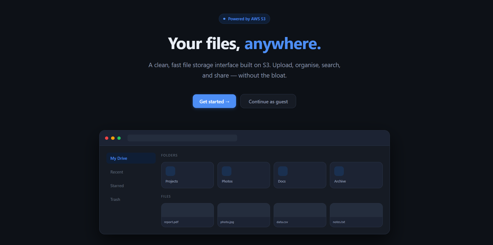
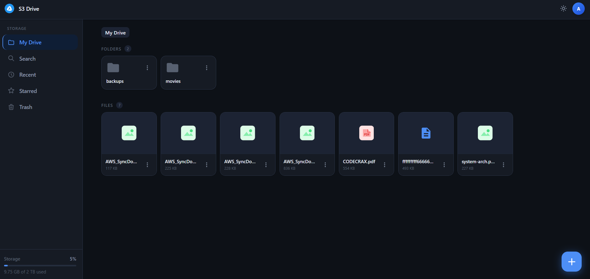

# S3 Drive

> **A self-hosted Google Drive alternative built on AWS S3 and Go.**  
> 50% cheaper than Google Drive. Runs on your own infrastructure. No vendor lock-in.




---

## What is this?

S3 Drive is a full-featured file storage platform you host yourself. It gives you a Google Drive-style experience — folders, search, starring, trash, drag-and-drop uploads — backed by S3-compatible object storage and a Go backend that fits in a single binary.

No subscription. No per-seat pricing. No data leaving your control.

---

## Cost comparison

| Storage | 1 TB/month | 2 TB/month |
|---------|-----------|-----------|
| Google Drive | $9.99 | $9.99 + overage |
| S3 Drive (AWS S3) | ~$23 | ~$46 |
| S3 Drive (Cloudflare R2) | **$4.50** | **$9.00** |
| S3 Drive (self-hosted MinIO) | **~$0** | **~$0** |

> Tested on Cloudflare R2 — **~50% cheaper** than Google Drive One at equivalent storage tiers, with zero egress fees.

---

## Architecture

```
                                    ┌─────────────────────────────────────┐
                                    │           GitHub Actions            │
                                    │                                     │
                                    │  push to main → build → deploy      │
                                    │  kubectl apply → k8s rolling update │
                                    └──────────────┬──────────────────────┘
                                                   │
                                                   ▼
┌──────────────┐    HTTPS     ┌────────────────────────────────────────────┐
│    Browser   │◄────────────►│           Cloudflare Tunnel                │
│  React + Vite│              │         (no open ports needed)             │
└──────────────┘              └────────────────┬───────────────────────────┘
                                               │
                                               ▼
                              ┌────────────────────────────────────────────┐
                              │          k3s Cluster (bare metal)          │
                              │                                            │
                              │  ┌──────────────────────────────────────┐  │
                              │  │         Traefik Ingress              │  │
                              │  └──────────────┬───────────────────────┘  │
                              │                 │                          │
                              │                 ▼                          │
                              │  ┌──────────────────────────────────────┐  │
                              │  │         Go Binary (single pod)       │  │
                              │  │                                      │  │
                              │  │  ┌─────────┐  ┌──────────────────┐   │  │
                              │  │  │  Auth   │  │   File Handlers  │   │  │
                              │  │  │  JWT    │  │  Upload / List   │   │  │
                              │  │  └─────────┘  │  Download / Star │   │  │
                              │  │               │  Search / Trash  │   │  │
                              │  │               └──────────────────┘   │  │
                              │  │                                      │  │
                              │  │  ┌─────────┐  ┌──────────────────┐   │  │
                              │  │  │ SQLite  │  │   In-Memory      │   │  │
                              │  │  │  / DB   │  │   Cache Layer    │   │  │
                              │  │  └─────────┘  └──────────────────┘   │  │
                              │  └──────────────────────────────────────┘  │
                              │                                            │
                              └────────────────────────────────────────────┘
                                                 │
                                ┌────────────────┼────────────────┐
                                ▼                ▼                ▼
                        ┌──────────────┐  ┌──────────────┐  ┌──────────────┐
                        │   AWS S3     │  │  Cloudflare  │  │   MinIO      │
                        │              │  │     R2       │  │ (self-hosted)│
                        └──────────────┘  └──────────────┘  └──────────────┘
```

---

## Features

**Storage**
- Nested folders up to 10 levels deep
- Drag-and-drop multi-file uploads with real-time progress
- Presigned URLs — files transfer directly browser ↔ S3, bypassing the server
- Hard delete + soft delete with 30-day trash retention
- Automatic cleanup task runs in background

**UX**
- Star/unstar files and folders
- Full-text search across your entire drive
- Recent files view
- Light / dark theme with system preference detection
- Mobile-responsive — works on any screen size

**Auth**
- JWT-based authentication (24h expiry)
- Admin role — full read/write access, password management
- Guest role — read-only, public files only, rate limited
- bcrypt password hashing

**Infrastructure**
- Single Go binary — embeds the entire React frontend via `embed.FS`
- S3-compatible — swap between AWS S3, Cloudflare R2, or MinIO via env vars
- In-memory cache with per-user, per-folder key invalidation
- Rate limiting middleware on all public and upload endpoints
- CORS configured for your domains

---

## Tech stack

| Layer | Tech |
|-------|------|
| Frontend | React 19, Vite, Tailwind CSS v4 |
| Backend | Go, `net/http` (no framework) |
| Auth | JWT (`golang-jwt/jwt`), bcrypt |
| Database | SQLite (GORM) |
| Storage | AWS S3 / Cloudflare R2 / MinIO |
| Infra | k3s, Traefik, Cloudflare Tunnel |
| CI/CD | GitHub Actions → `kubectl` rolling deploy |

---

## CI/CD

Every push to `main` triggers a GitHub Actions pipeline:

```yaml
# .github/workflows/deploy.yml (simplified)

jobs:
  deploy:
    steps:
      - name: Build Go binary + embed frontend
        run: |
          cd frontend && npm ci && npm run build
          go build -o s3drive .

      - name: Build & push Docker image
        run: |
          docker build -t ghcr.io/${{ github.repository }}:${{ github.sha }} .
          docker push ghcr.io/${{ github.repository }}:${{ github.sha }}

      - name: Deploy to k8s
        run: |
          kubectl set image deployment/s3drive \
            s3drive=ghcr.io/${{ github.repository }}:${{ github.sha }}
          kubectl rollout status deployment/s3drive
```

Zero-downtime rolling updates. The cluster pulls the new image and replaces pods one at a time.

---

## Self-hosting

### Prerequisites

- A k8s / k3s cluster (or any server with Docker)
- An S3-compatible bucket (AWS S3, Cloudflare R2, or MinIO)
- A domain with Cloudflare (optional but recommended)

### Environment variables

```env
# Storage
S3_ENDPOINT=https://s3.amazonaws.com     # or R2 / MinIO endpoint
S3_BUCKET=your-bucket-name
S3_REGION=ap-south-1
AWS_ACCESS_KEY_ID=your-key
AWS_SECRET_ACCESS_KEY=your-secret

# Auth
JWT_SECRET=replace-with-a-long-random-string

# DB
DB_PATH=./drive.db
```

### Run with Docker

```bash
docker run -d \
  --name s3drive \
  -p 80:80 \
  --env-file .env \
  ghcr.io/joshi-labs/s3drive:latest
```

### Run locally

```bash
# Build frontend
cd frontend && npm install && npm run build && cd ..

# Run Go server (serves frontend + API on :80)
go run .
```

---

## Storage backends

Switch backends by changing two env vars — no code changes needed.

**AWS S3**
```env
S3_ENDPOINT=https://s3.amazonaws.com
S3_REGION=ap-south-1
```

**Cloudflare R2** (zero egress fees)
```env
S3_ENDPOINT=https://<account-id>.r2.cloudflarestorage.com
S3_REGION=auto
```

**MinIO** (fully self-hosted, ~$0/month)
```env
S3_ENDPOINT=http://your-minio-server:9000
S3_REGION=us-east-1
```

---

## API reference

| Method | Endpoint | Auth | Description |
|--------|----------|------|-------------|
| `POST` | `/api/login` | — | Admin login, returns JWT |
| `POST` | `/api/guest-login` | — | Guest login, returns JWT |
| `GET` | `/api/files?parentId=` | ✓ | List folder contents |
| `POST` | `/api/folders` | ✓ | Create folder |
| `POST` | `/api/upload-init` | ✓ | Get presigned S3 PUT URL |
| `POST` | `/api/upload-finalize` | ✓ | Mark upload complete |
| `GET` | `/api/download?id=` | ✓ | Get presigned S3 GET URL |
| `GET` | `/api/search?q=` | ✓ | Search files |
| `GET` | `/api/recents` | ✓ | Recently modified files |
| `GET` | `/api/starred` | ✓ | Starred files |
| `POST` | `/api/star-toggle` | ✓ | Toggle star on a file |
| `POST` | `/api/soft-delete` | ✓ | Move to trash |
| `POST` | `/api/restore` | ✓ | Restore from trash |
| `DELETE` | `/api/delete?id=` | ✓ | Permanently delete |
| `GET` | `/api/trash` | ✓ | List trash |
| `POST` | `/api/admin/update-password` | ✓ Admin | Change admin password |

---

## Project structure

```
s3drive/
├── main.go                  # HTTP server, routes, handlers
├── internal/
│   ├── database/            # GORM models, queries, cache
│   ├── storage/             # S3 client, presigned URLs
│   └── middleware/          # Rate limiting, cleanup
├── frontend/
│   ├── src/
│   │   ├── pages/           # DriveView, LoginPage, LandingPage...
│   │   ├── components/      # DriveItems, Navbar, Sidebar...
│   │   ├── hooks/           # useDrive (API abstraction)
│   │   └── context/         # ThemeContext
│   └── dist/                # Built by Vite, embedded into Go binary
├── .github/workflows/       # GitHub Actions CI/CD
└── Dockerfile
```

---

## Live demo

**[s3-drive.vpjoshi.in](https://s3-drive.vpjoshi.in)** — running on a home k8s server (i3-7100, 8GB RAM).  
Use guest login to explore. Expect occasional cold starts — it's a homelab, not AWS.

→ [Server stats](https://stats.vpjoshi.in) · [Portfolio](https://vpjoshi.in) · [Docs](https://docs.vpjoshi.in)

---

## License

MIT — do whatever you want with it.